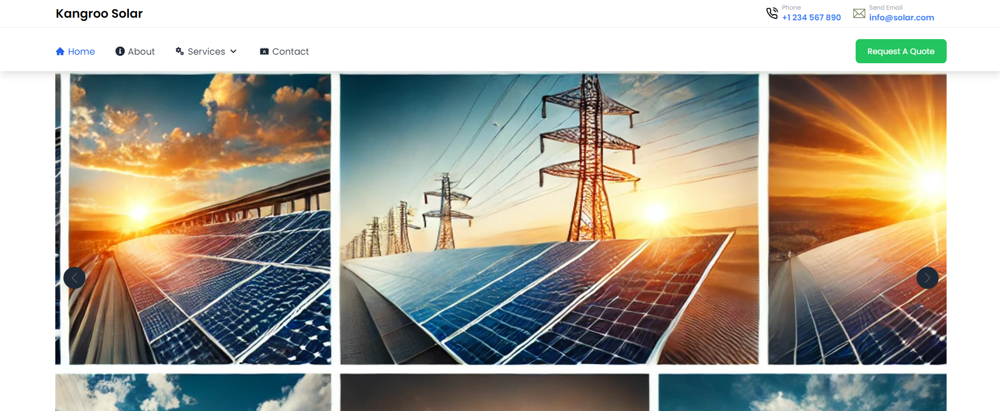
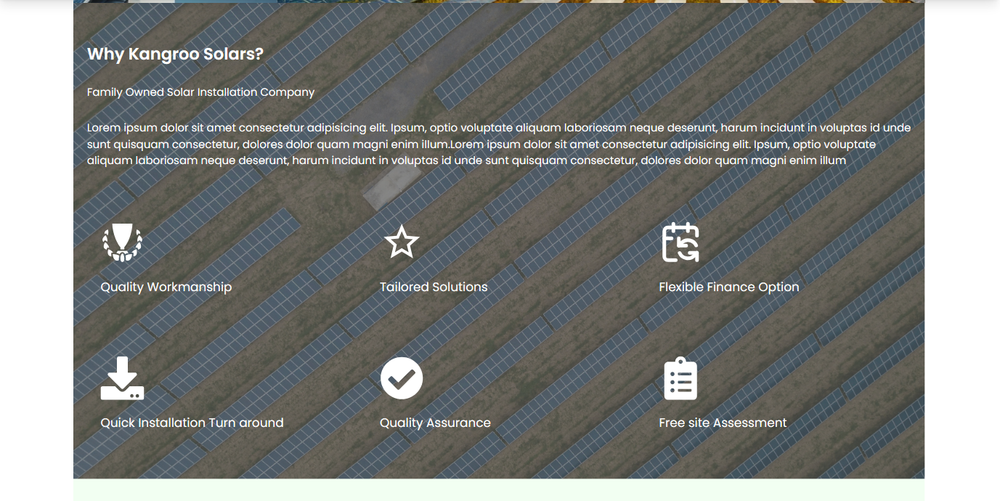
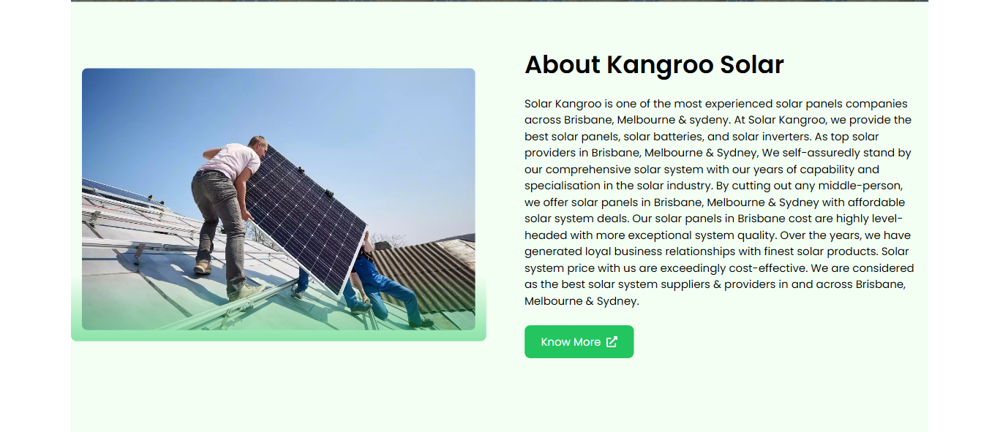
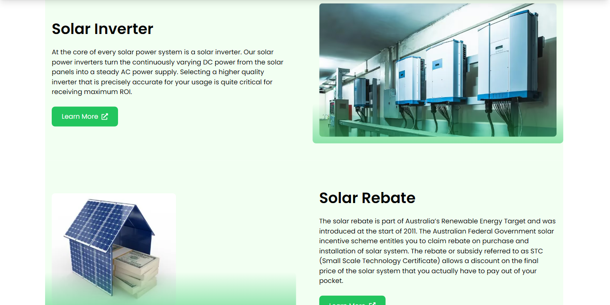
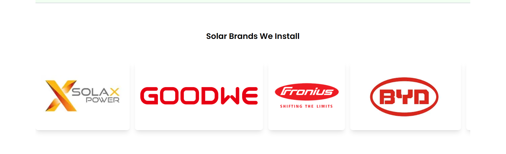
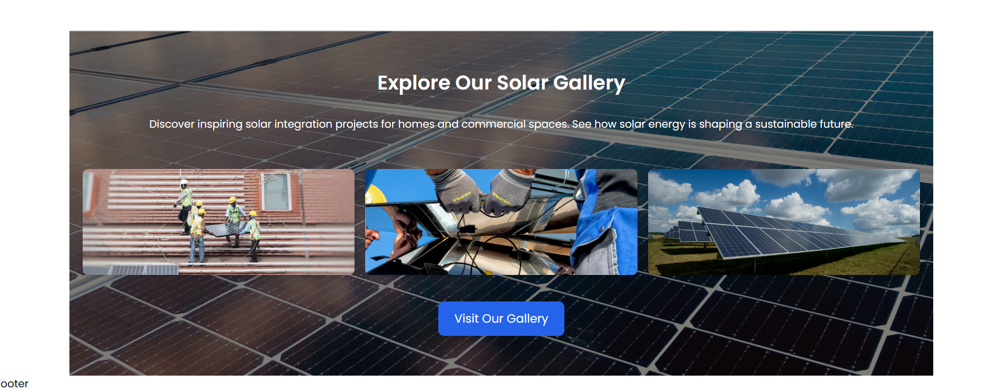

<div align="center">
  <h1>Kangroo-Solar</h1>
</div>

---

## 🛠️ Prerequisites  

Before you begin, make sure you have the following installed:  

- 📥 [Node.js](https://nodejs.org/) (LTS recommended)  
- 📦 npm or [Yarn](https://yarnpkg.com/)  

---

## 📂 Project Structure
```
  src/
  ├── components/    # Reusable components  
  ├── pages/         # Application pages  
  ├── assets/        # Images, styles, etc.  
  ├── App.js         # Main app component  
  ├── index.js       # Entry point
```

## 🚀 Getting Started  

1. **Clone the repository** 🖥️  
   ```bash
   git clone https://github.com/amish0301/kangroo-solar.git
   cd kangroo-solar

2. **Install dependencies** 📦
  `npm install` or `yarn install`

3. **Start the development server** 🌐
  `npm run dev` or `yarn run dev`

4. **open your browser and navigate to** 
  👉 http://localhost:5173


## Styling Guildelines

- Font Style : ***Poppins***
- Styling Library: ***TailwindCSS***


## Images


<br />

<br />

<br />

<br />

<br />
